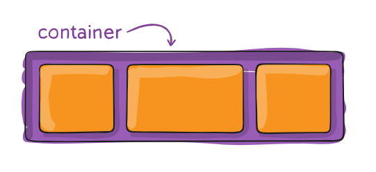

# CSS Flexbox Layout Guide

# O que é o Flexbox ?

O CSS Flexbox Layout é um modelo de layout moderno que facilita o design de interfaces responsivas e flexíveis em CSS. Ele permite que você `organize elementos` em uma página web de forma mais eficiente, controlando sua disposição, alinhamento e distribuição de espaço. 

Principais características do Flexbox:

- Flexibilidade: Os elementos podem crescer ou encolher para se ajustar ao espaço disponível.
- Direção: Você pode organizar os elementos em linha ou em coluna.
- Alinhamento: Oferece controle preciso sobre o alinhamento vertical e horizontal dos elementos.
- Ordem: Permite alterar a ordem dos elementos sem modificar o HTML.

# Como utilizar ?

Para se utilizar o modelo flexbox precisamos ter 2 elementos, são eles:

- Container
    - Um elemento HTML que fique por volta dos itens.
    
    
    
- Item
    - Um elemento HTML que fica dentro do container.
    
    
    

## Exemplo de Código

**`⚠️ Esse código html será usado em todos os exemplos de css e classes css`**

### HTML:

```html
<!DOCTYPE html>
<html lang="pt-br">
<head>
    <meta charset="UTF-8">
    <meta name="viewport" content="width=device-width, initial-scale=1.0">
    <title>Exemplo Flexbox</title>
    <link rel="stylesheet" href="styles.css">
</head>
<body>
    <div class="container">
        <div class="item">Item 1</div>
        <div class="item">Item 2</div>
        <div class="item">Item 3</div>
    </div>
</body>
</html>
```

### CSS:

```css
.container {
    display: flex;
        background-color: #995DB5;
 }
.item {
    background-color: #F7941F;
    color: white;
}
```

### Utilizando Flexbox como uma `classe` no `html`

Para utilizar o Flexbox de forma semelhante a uma classe do Bootstrap, você pode criar classes utilitárias em seu CSS:

Agora você pode usar essas classes em seu HTML, similar ao Bootstrap:

```html
<div class="flex">
<div class="item">Item 1</div>
    <div class="item">Item 2</div>
    <div class="item">Item 3</div>
</div>
```

Desta forma, você pode aplicar propriedades Flexbox rapidamente a elementos HTML, semelhante à abordagem do Bootstrap.

# Como mexer na direção ?

Nos podemos modificar como nossos items sãos mostrados na tela atraves do `flex-direction`

Através dele podemos posicionar os itens:

**`⚠️ Por padrão ao utilizar o flex os items ficam na direção row.`**

- Um do lado do outro | `row`
- Um do lado do outro invertido | `row-reverse`
- Um embaixo do outro | `column`
- Um embaixo do outro invertido | `column-reverse`


## Exemplo de Código

Exemplo de uso com o arquivo css para o html:

```css
.container {
    display: flex;
        flex-direction: row;
        background-color: #995DB5;

 }
.item {
    background-color: #F7941F;
    color: white;
}
```

Exemplo de uso com classes no html:

```html
<div class="flex flex-row">
<div class="item">Item 1</div>
    <div class="item">Item 2</div>
    <div class="item">Item 3</div>
</div>
```

# Como posicionar na horizontal ?

Para posicionar itens horizontalmente em um container flexbox, usamos a propriedade `justify-content`. Esta propriedade controla o alinhamento dos itens ao longo do eixo principal (horizontal para `flex-direction: row`).

Aqui estão as principais opções de `justify-content`:

- `flex-start`: Alinha os itens no início do container (padrão)
- `flex-end`: Alinha os itens no final do container
- `center`: Centraliza os itens no container
- `space-between`: Distribui os itens uniformemente, com o primeiro item no início e o último no final
- `space-around`: Distribui os itens uniformemente com espaço igual ao redor de cada item
- `space-evenly`: Distribui os itens uniformemente com espaço igual entre eles

Tabela com os comandos em classes:

| Propriedade CSS | Classe Utilitária |
| --- | --- |
| `flex-direction: row;` | `flex-row` |
| `flex-direction: column;` | `flex-column` |
| `justify-content: center;` | `justify-content-center` |
| `justify-content: flex-start;` | `justify-content-start` |
| `justify-content: flex-end;` | `justify-content-end` |
| `justify-content: space-between;` | `justify-content-between` |
| `justify-content: space-around;` | `justify-content-around` |


Exemplo de uso com arquivo css para o html:

```css
.container {
    display: flex;
        flex-direction: row;
        justify-content: center;
        background-color: #995DB5;

 }
.item {
    background-color: #F7941F;
    color: white;
}
```

Exemplo de uso com classes no html:

```html
<div class="flex flex-row justify-content-center">
  <div class="item">Item 1</div>
  <div class="item">Item 2</div>
  <div class="item">Item 3</div>
</div>
```

Este exemplo criará um container flexbox com itens alinhados horizontalmente e centralizados.

# Como posicionar na Verticalmente?

Para posicionar itens verticalmente em um container flexbox, usamos a propriedade `align-items`. Esta propriedade controla o alinhamento dos itens ao longo do eixo transversal (vertical para `flex-direction: row`).

Aqui estão as principais opções de `align-items`:

- `stretch`: Estica os itens para preencher o container (padrão)
- `flex-start`: Alinha os itens no início do eixo transversal
- `flex-end`: Alinha os itens no final do eixo transversal
- `center`: Centraliza os itens verticalmente
- `baseline`: Alinha os itens pela linha de base do texto

Tabela com os comandos em classes:

| Propriedade CSS | Classe Utilitária |
| --- | --- |
| `align-items: stretch;` | `align-items-stretch` |
| `align-items: flex-start;` | `align-items-start` |
| `align-items: flex-end;` | `align-items-end` |
| `align-items: center;` | `align-items-center` |
| `align-items: baseline;` | `align-items-baseline` |


Exemplo de uso com arquivo css para o html:

```css
.container {
    display: flex;
    flex-direction: row;
    align-items: center;
    background-color: #995DB5;
    height: 200px; /* Para demonstrar o alinhamento vertical */
}
.item {
    background-color: #F7941F;
    color: white;
}
```

Exemplo de uso com classes no html:

```html
<div class="flex flex-row align-items-center" style="height: 200px;">
  <div class="item">Item 1</div>
  <div class="item">Item 2</div>
  <div class="item">Item 3</div>
</div>
```

Este exemplo criará um container flexbox com itens alinhados horizontalmente e centralizados verticalmente.